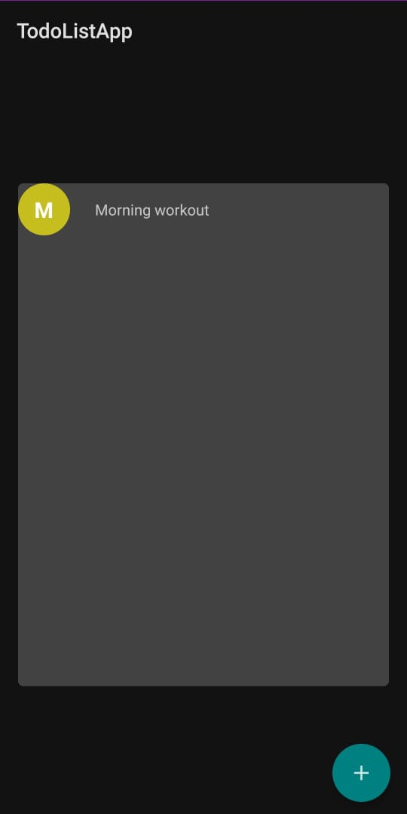
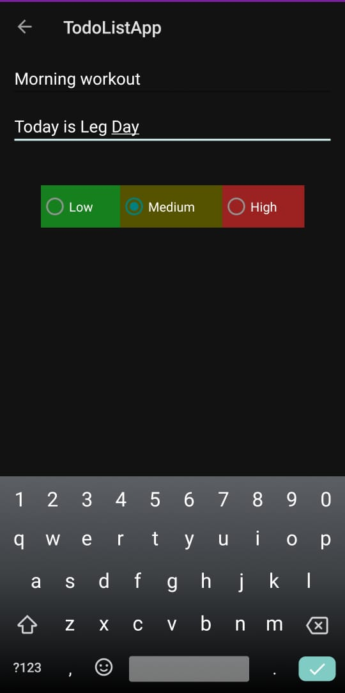

# ANDROID-STUDY-JAMS

## TodoListApp

### Problem Statement

It is very difficult to manage your daily tasks without a todo list. While conventional pen-and-paper methods are fine for small tasks, they are not flexible enough for large tasks. Also, you will carry your phone around much more frequently than a paper that can be easily torn.

### Proposed Solution

You need a mobile app to manage your daily tasks. And, the current apps in the market are too bulky and overdone. So, we've created a simple and practical app for this purpose.

   
   

### Functionality and Concepts used

- Used CardView and RecyclerView for displaying the list of tasks.
- Used Room for storing the data.
- Created intents for adding, editing and deleting the tasks.

### Application Link 

The app is currently in the Alpha testing phase with GNITS institute with a limited no. of users, You can access the app : https://github.com/ash97531/Android-Study-Jams

### Future Scope

Once the app is fully tested and functional in IIIT SriCity, We tried to make todo list apk so that person can save their daily routine and do according to that routine will make easy to remember things. This can be extended to event reminder using alarm system to remind the person to do its work with a sound. 

### Created by

- Yash Gupta
- Ashwani Kumar
- Avinash Bhojanapalli

### Special thanks to the Google developers' Kotlin Course for providing the concepts required to make this app.

